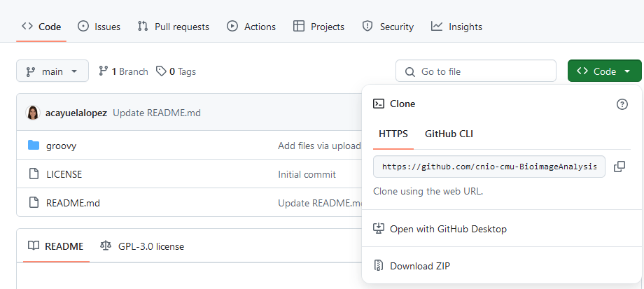
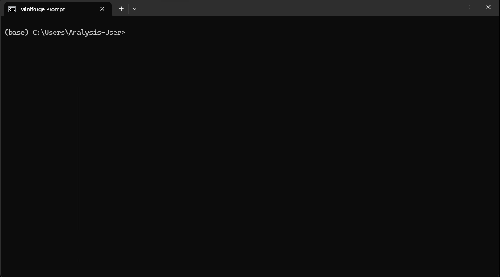

# processTelomereSegmentation

This Python script processes the output CSV files from QuPath telomere segmentation. It calculates several new features related to telomere intensity per nucleus and saves the results into a specified output directory.

## Download processTelomereSegmentation code

1. Go to the GitHub repository `processTelomereSegmentation`
2. Click on `<> Code` > `Download ZIP`
   
<p align="center">
    
</p>

3. The downloaded repo will be found in the Downloads directory of your computer.

## Setting up the environment

1. Open a terminal or Anaconda Prompt.

    **TIP**: In the Microscopy Unit, we usually work with Miniforge. There is already a preconfigured environment to run this code. Most workstations have a shortcut to open the Miniforge Prompt directly.
    Make sure that the window title says something like:

    <p align="center">
    
    </p>

    <p align="center">
    
    </p>


2. Activate the `cellpose` environment (or the environment where your required packages are installed).  
If you used Anaconda to install Cellpose, you can activate it by typing:

```bash
conda activate cellpose
```

**Note**: If you installed the dependencies in a different environment, make sure to activate the correct one.

## Running the script

1. Navigate to the location where you downloaded the repository and **inside the src folder in the repository**:

```bash
cd path/to/telomere_quantification/src
```

2. Run the main Python script:

```bash
python main.py
```

3. A GUI will pop up asking you to select:
   - **Input directory**: The folder where your QuPath telomere segmentation CSV files are stored.

        **CAUTION**: The **input directory must contain only the .csv files you want to process**.Do **not** include any other files in that folder, as the script assumes all files ending in .csv are valid inputs and will attempt to process them. 
   
   - **Output directory**: The folder where the processed CSV files with the new calculated features will be saved.

4. After selecting the directories, the script will start processing each file.
When the processing finishes, you will see a message in the terminal for each file like:
    ```bash
    Processed file saved at: [path_to_file]_processed.csv
    ```
    This confirms that the file was successfully processed and saved.
    Each processed file keeps its original name with the suffix _processed added.

5. Once the script finishes, you will find the processed CSV files in your selected output directory.  
Each output CSV will include the following new calculated columns:

| Column name | Description |
| :---------- | :----------- |
| `Integrated density` | Sum intensity of each spot = mean intensity × area |
| `Integrated density - mean per cell` | Mean per nucleus of sum intensity |
| `Integrated density*number of foci - mean per cell` | Mean per nucleus of sum intensity × number of foci |
| `Mean intensity - mean per cell` | Mean per nucleus of mean intensity |
| `Max intensity - mean per cell` | Mean per nucleus of max intensity |
| `Max intensity*number of foci - mean per cell` | Mean per nucleus of max intensity × number of foci |

6. You can now use the processed data for further analysis!
